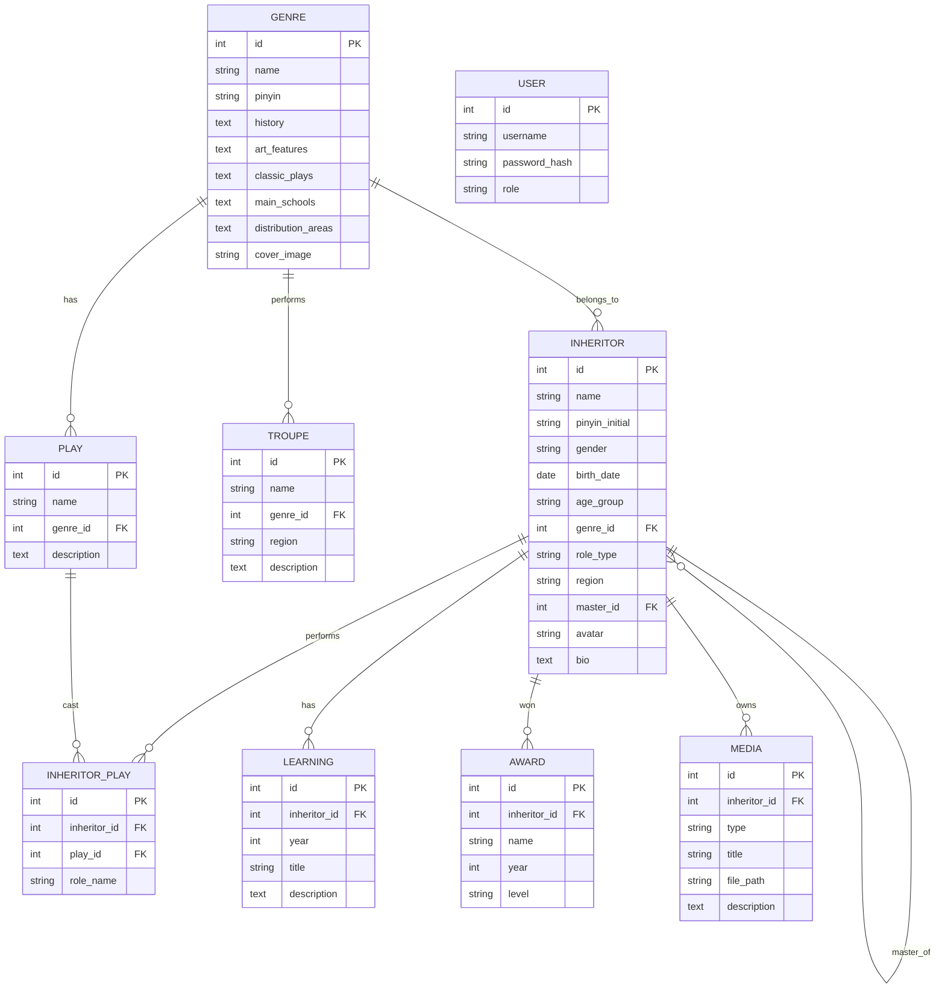

## 1. 架构设计

```mermaid
flowchart TD
    subgraph "客户端"
        "浏览器 / 手机端"
    end
    subgraph "前端(Vue3 + Vite)"
        "名录查询页"
        "传承人详情页"
        "后台管理页"
        "剧种百科页"
    end
    subgraph "后端(FastAPI)"
        "API 路由层"
        "业务服务层"
        "ORM 数据访问层"
        "文件存储(本地)"
    end
    subgraph "数据层"
        "PostgreSQL"
        "本地文件卷(头像/音视频)"
    end
    "浏览器 / 手机端" --> "前端(Vue3 + Vite)"
    "前端(Vue3 + Vite)" --> "API 路由层"
    "API 路由层" --> "业务服务层"
    "业务服务层" --> "ORM 数据访问层"
    "业务服务层" --> "文件存储(本地)"
    "ORM 数据访问层" --> "PostgreSQL"
    "文件存储(本地)" --> "本地文件卷(头像/音视频)"
```

## 2. 技术描述

- **前端**：Vue@3 + Vue Router + Pinia + Tailwind CSS@3 + Vite + TypeScript。用 `vite-init` 的 `vue-ts` 模板初始化（纯前端模板），后端单独为 FastAPI。
- **后端**：FastAPI + SQLAlchemy@2 + Pydantic@2 + Alembic 迁移（可选，初期用 SQL 建表脚本） + `openpyxl` 解析 Excel + `pypinyin` 计算拼音首字母 + `passlib` 密码哈希 + `python-jose` JWT。
- **数据库**：PostgreSQL@15，带 GIN 索引以支持 `ILIKE`/`pg_trgm` 模糊搜索加速（响应 ≤ 300ms）。
- **文件存储**：服务器本地目录 `backend/uploads/{avatars,audio,video}`，通过 FastAPI `StaticFiles` 暴露。
- **部署**：docker-compose 一键启动 `db` / `backend` / `frontend` 三个服务。
- **包管理**：前端 npm（环境已有 node）；后端 pip + requirements.txt。

## 3. 路由定义（前端）

| 路由 | 用途 |
|------|------|
| `/` | 首页：系统简介 + 模块入口 |
| `/directory` | 名录查询页 |
| `/inheritor/:id` | 传承人详情页 |
| `/genres` | 剧种百科列表页 |
| `/genres/:id` | 剧种百科详情页 |
| `/admin` | 后台管理首页（传承人列表） |
| `/admin/inheritor/new` | 新增传承人 |
| `/admin/inheritor/:id/edit` | 编辑传承人 |
| `/admin/import` | 批量导入页 |
| `/login` | 管理员登录 |

## 4. API 定义（后端）

### 4.1 传承人

| 方法 | 路径 | 说明 |
|------|------|------|
| GET | `/api/inheritors` | 列表查询，支持 `genre`/`role`/`region`/`master`/`age_group`/`pinyin`/`keyword`/`page`/`size` |
| GET | `/api/inheritors/{id}` | 传承人详情（含学艺经历、剧目、获奖、音视频） |
| POST | `/api/inheritors` | 新增（管理员） |
| PUT | `/api/inheritors/{id}` | 编辑（管理员） |
| DELETE | `/api/inheritors/{id}` | 删除（管理员） |
| GET | `/api/inheritors/search` | 模糊搜索姓名（≤300ms，走 pg_trgm 索引） |
| GET | `/api/inheritors/pinyin/{initial}` | 按姓氏拼音首字母索引 |
| POST | `/api/inheritors/batch` | 批量导入（管理员） |

### 4.2 剧种

| 方法 | 路径 | 说明 |
|------|------|------|
| GET | `/api/genres` | 剧种列表 |
| GET | `/api/genres/{id}` | 剧种详情（含关联传承人、剧团） |

### 4.3 文件上传

| 方法 | 路径 | 说明 |
|------|------|------|
| POST | `/api/upload/avatar` | 头像上传，返回访问 URL |
| POST | `/api/upload/media` | 音视频上传 |

### 4.4 鉴权

| 方法 | 路径 | 说明 |
|------|------|------|
| POST | `/api/auth/login` | 登录，返回 JWT |

## 5. 服务端架构图

```mermaid
flowchart TD
    "Router 控制层" --> "Service 业务层"
    "Service 业务层" --> "Repository 数据访问层"
    "Repository 数据访问层" --> "PostgreSQL"
    "Service 业务层" --> "Storage 本地文件"
```

- **Router**：FastAPI 路由，参数校验（Pydantic），鉴权依赖注入。
- **Service**：业务逻辑、Excel 解析、拼音计算、文件保存。
- **Repository**：SQLAlchemy 查询封装，分页、筛选、模糊搜索。
- **Storage**：本地文件写入与静态访问。

## 6. 数据模型

### 6.1 数据模型定义



### 6.2 数据定义语言

关键索引：传承人姓名建 GIN `pg_trgm` 索引以加速模糊搜索；`(genre_id)`、`(role_type)`、`(region)`、`(age_group)`、`(pinyin_initial)`、`(master_id)` 建普通 B-tree 索引以加速多维筛选。

```sql
CREATE EXTENSION IF NOT EXISTS pg_trgm;

CREATE TABLE genres (
    id SERIAL PRIMARY KEY,
    name VARCHAR(64) NOT NULL,
    pinyin VARCHAR(128),
    history TEXT,
    art_features TEXT,
    classic_plays TEXT,
    main_schools TEXT,
    distribution_areas TEXT,
    cover_image VARCHAR(256)
);

CREATE TABLE inheritors (
    id SERIAL PRIMARY KEY,
    name VARCHAR(32) NOT NULL,
    pinyin_initial CHAR(1),
    gender VARCHAR(8),
    birth_date DATE,
    age_group VARCHAR(16),
    genre_id INT REFERENCES genres(id),
    role_type VARCHAR(32),
    region VARCHAR(64),
    master_id INT REFERENCES inheritors(id),
    avatar VARCHAR(256),
    bio TEXT
);
CREATE INDEX idx_inheritors_name_trgm ON inheritors USING GIN (name gin_trgm_ops);
CREATE INDEX idx_inheritors_genre ON inheritors(genre_id);
CREATE INDEX idx_inheritors_role ON inheritors(role_type);
CREATE INDEX idx_inheritors_region ON inheritors(region);
CREATE INDEX idx_inheritors_age ON inheritors(age_group);
CREATE INDEX idx_inheritors_pinyin ON inheritors(pinyin_initial);
CREATE INDEX idx_inheritors_master ON inheritors(master_id);

CREATE TABLE plays (
    id SERIAL PRIMARY KEY,
    name VARCHAR(128) NOT NULL,
    genre_id INT REFERENCES genres(id),
    description TEXT
);

CREATE TABLE inheritor_plays (
    id SERIAL PRIMARY KEY,
    inheritor_id INT REFERENCES inheritors(id) ON DELETE CASCADE,
    play_id INT REFERENCES plays(id),
    role_name VARCHAR(64)
);

CREATE TABLE learning (
    id SERIAL PRIMARY KEY,
    inheritor_id INT REFERENCES inheritors(id) ON DELETE CASCADE,
    year INT,
    title VARCHAR(128),
    description TEXT
);

CREATE TABLE awards (
    id SERIAL PRIMARY KEY,
    inheritor_id INT REFERENCES inheritors(id) ON DELETE CASCADE,
    name VARCHAR(128),
    year INT,
    level VARCHAR(32)
);

CREATE TABLE media (
    id SERIAL PRIMARY KEY,
    inheritor_id INT REFERENCES inheritors(id) ON DELETE CASCADE,
    type VARCHAR(16),
    title VARCHAR(128),
    file_path VARCHAR(256),
    description TEXT
);

CREATE TABLE troupes (
    id SERIAL PRIMARY KEY,
    name VARCHAR(128) NOT NULL,
    genre_id INT REFERENCES genres(id),
    region VARCHAR(64),
    description TEXT
);

CREATE TABLE users (
    id SERIAL PRIMARY KEY,
    username VARCHAR(64) UNIQUE NOT NULL,
    password_hash VARCHAR(256) NOT NULL,
    role VARCHAR(16) DEFAULT 'admin'
);
```
